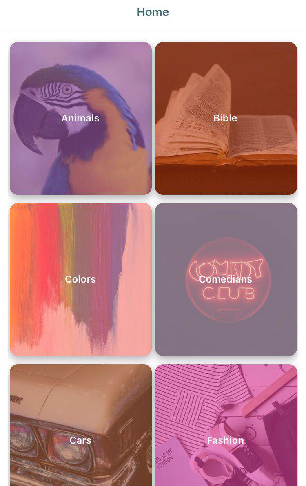
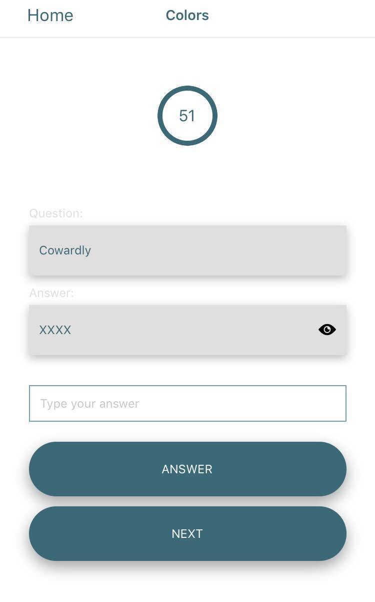

## TriviaApp

---

 

---

## **API:**

The App uses [jservice](http://jservice.io/) for the Trivia questions and answers

# Getting started

## Installing Dependencies

```sh
yarn
```

or

```sh
npm install
```

## Run the App

```sh
expo start
```
